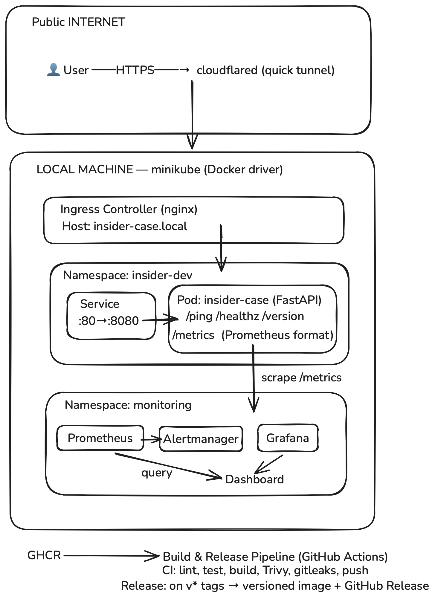

# insider-devops-case

> Insider One DevOps Internship Case Study — a small, end-to-end production slice.

A tiny FastAPI service, packaged with Docker, deployed to minikube via Helm, automated through GitHub Actions, made observable with Prometheus and Grafana, and exposed to the internet through a Cloudflare tunnel.

**Track:** B — local minikube + tunnel
**Status:** Complete

## Quick start
 
```bash
# 1. Install Python deps and run unit tests
make venv
make test
 
# 2. Run the service in Docker
docker compose up -d --build
curl http://localhost:8080/ping
# {"message":"pong"}
 
# 3. Or, deploy the same image into minikube
make cluster-up        # start minikube and enable ingress
make image-load        # build into minikube's Docker
make deploy-dev        # helm upgrade --install on the dev release
```

See `make help` for the full target list (build, deploy, rollback, status, port-forward, ci-local, etc.).

## Endpoints

| Path           | Purpose                                  |
|----------------|------------------------------------------|
| `GET /`        | Welcome / discovery — lists endpoints    |
| `GET /ping`    | Smoke test, returns `pong`               |
| `GET /healthz` | Liveness / readiness probe target        |
| `GET /version` | Build SHA and app name                   |
| `GET /metrics` | Prometheus exposition (RPS, latency, …)  |
| `GET /docs`    | Auto-generated OpenAPI / Swagger UI      |
 
Every response includes an `x-request-id` header. Pass `X-Request-ID:` in to trace a request through the JSON logs.

## Architecture


 
Top to bottom:
 
- **Public internet** → `cloudflared` quick tunnel (`*.trycloudflare.com`) → minikube's nginx Ingress (`insider-case.local`) → `ClusterIP` Service → Pod.
- **Observability** runs in its own `monitoring` namespace via `kube-prometheus-stack`: Prometheus scrapes the Pod's `/metrics`; Grafana queries Prometheus; Alertmanager handles the rules we install.
- **Supply chain** is GitHub-side: PRs go through `ci.yml` (lint, test, helm lint, build, Trivy, gitleaks); merges to `main` push to GHCR; `v*` tags trigger `release.yml` for a versioned image + a GitHub Release.

## Repository layout

```
.
├── app/                       # FastAPI service
├── tests/                     # pytest suite
├── helm/insider-case/         # Helm chart with values-dev.yaml / values-prod.yaml
├── .github/workflows/
│   ├── ci.yml                 # lint, test, build, scan, push
│   └── release.yml            # on v* tags: versioned image + GitHub Release
├── docs/
│   ├── adr/                   # Architecture Decision Records
│   └── screenshots/           # Evidence captures (Day 2, 3, 4)
├── Dockerfile                 # multi-stage, non-root, slim base
├── docker-compose.yaml
├── Makefile                   # reproducible local commands (Track B IaC)
├── CHANGELOG.md
├── RUNBOOK.md                 # one-page operational guide
├── SECURITY.md
└── README.md
```

## Configuration

All config is environment-driven (12-factor). See `.env.example`.

| Variable    | Default          | Purpose                                |
|-------------|------------------|----------------------------------------|
| `APP_NAME`  | `insider-case`   | Used in logs and `/version`            |
| `BUILD_SHA` | `dev`            | Injected by CI at build time           |
| `LOG_LEVEL` | `INFO`           | `DEBUG`, `INFO`, `WARNING`, `ERROR`    |

## Day 2 evidence

Two environments deployed from the same chart with deliberately different values:

| Aspect       | Dev (`insider-dev` ns) | Prod (`insider-prod` ns) |
|--------------|------------------------|---------------------------|
| Release      | `app`                  | `app-prod`                |
| Replicas     | 1                      | 3                         |
| Ingress host | `insider-case.local`   | `insider-case.example.com`|
| Log level    | `DEBUG`                | `INFO`                    |
| Resources    | tight (25m / 32Mi)     | generous (100m / 96Mi)    |

A rollout/rollback cycle was exercised on the dev release. See `helm history app -n insider-dev`:

| Revision | Status     | Description       |
|----------|------------|-------------------|
| 1        | superseded | Install complete  |
| 2        | superseded | Upgrade complete  |
| 3        | superseded | Rollback to 1     |
| 4        | superseded | Upgrade complete  |
| 5        | deployed   | Rollback to 1     |

Screenshots of the cluster state are under `docs/screenshots/`.

### Resource value rationale

Values were chosen to leave headroom on a single-node minikube while keeping the QoS class predictable:
- Dev `requests: 25m/32Mi, limits: 100m/96Mi` — minimal footprint, room for multiple services on the same node.
- Prod `requests: 100m/96Mi, limits: 500m/256Mi` — more headroom for 3 replicas, still well under typical node limits.


## Day 3 evidence

### CI pipeline

Every PR and push to `main` runs four jobs in parallel-then-serial:

| Job | Tools | Purpose |
|-----|-------|---------|
| Lint & Test | ruff, pytest | Python code quality and unit tests |
| Helm Lint | helm | Chart validation + dev/prod template render |
| Secret Scan | gitleaks | Full-history scan with custom allowlist |
| Build, Scan & Push | docker, Trivy, GHCR | Multi-stage build, vuln scan, conditional push |

The push step only runs on `push` events to `main`. PR builds are scan-only to keep credentials safe from forks.

### Release flow

A separate `release.yml` workflow runs on `v*` tag pushes. To cut a release:

```bash
git tag -a v0.1.0 -m "first end-to-end slice"
git push origin v0.1.0
```

The workflow then:

- builds, scans (Trivy), and pushes the image to GHCR as `:0.1.0`, `:0.1`, and `:latest`
- creates a GitHub Release with notes extracted from the matching section of `CHANGELOG.md`

The image tag and the GitHub Release tag are kept in lockstep via `docker/metadata-action` with the `type=semver` pattern.

### Security findings caught by the pipeline

The first CI run failed because **Trivy flagged CVE-2025-62727** — a HIGH
severity DoS in Starlette 0.41.3 (a transitive dependency of FastAPI 0.115.4).
Fix landed in PR #4: upgrade FastAPI to 0.124.4, which bumps Starlette past
0.49 where the vulnerability is patched. **This is exactly the loop the
pipeline is built to enforce.**

Separately, `aquasecurity/trivy-action` is pinned to `v0.36.0` — the first
clean release after the March 2026 supply chain incident that compromised
75 historical tags of the same action.

### Auto-deploy on merge — choice and trade-off

**Choice:** auto-deploy is exposed as a Makefile target (`make deploy-ghcr`)
rather than wired into CI. The deploy itself is reproducible and one command;
the trigger is just kept manual for this case.

**Why not in CI:**

- The target cluster here is local minikube. GitHub-hosted runners can't
  reach a laptop's loopback Kubernetes API, so a CI step would either need
  a self-hosted runner or a publicly reachable cluster — both larger scope
  than this case study.
- Push-style deploy from CI also requires storing a long-lived kubeconfig
  as a secret, which violates the case's "no real credentials in the repo"
  goal. Track A (AWS EC2 + OIDC federation) would solve that part; Track B
  doesn't have that option.

**Why not ArgoCD / Flux:**

GitOps would be the more production-correct path: the cluster pulls instead
of CI pushing, and `main` becomes the single source of truth for cluster
state. Realistically, for a single-environment, single-service case study
it adds an ArgoCD install + an Application manifest + a separate config
repo (or directory) — all overhead with little extra teaching value on top
of what the rest of the pipeline already demonstrates.

**What this looks like locally today:**

After a PR merges to `main` and CI publishes a new `:latest` to GHCR:

```bash
make deploy-ghcr
```

That target pulls `ghcr.io/.../insider-case:latest` into minikube's Docker, runs `helm upgrade --install` on the dev release, and waits for the new pods to be ready.

**What I'd build next if this had to leave the laptop:**

A self-hosted runner inside the target cluster, then a `deploy.yml` workflow on `push` to `main` that uses it, and eventually ArgoCD ApplicationSet across `dev` and `prod` with `main` driving sync. The Makefile targets become the local debugging tool, not the production deploy path. See [ADR-005](docs/adr/005-deploy-via-makefile.md).

## Day 4 evidence
 
### Logs and metrics
 
Logs are structured JSON. Every record carries a `request_id` populated from the `X-Request-ID` header (or generated server-side if absent), so a single request can be followed across log lines:
 
```bash
curl -i -H "X-Request-ID: trace-01" http://insider-case.local/ping
# x-request-id: trace-01 in the response
 
kubectl logs -n insider-dev -l app.kubernetes.io/name=insider-case --tail=20
# {"timestamp":"...","level":"INFO","msg":"ping called","logger":"insider-case","request_id":"trace-01"}
```
 
Metrics are exposed at `GET /metrics` in Prometheus exposition format via `prometheus-fastapi-instrumentator`. Default series include `http_requests_total` (counter by handler, method, status), `http_request_duration_seconds` (histogram used for p50/p95/p99), and `process_*` / `python_gc_*` runtime metrics.
 
### Prometheus + Grafana
 
`kube-prometheus-stack` is installed via Helm into the `monitoring` namespace. The Helm chart for `insider-case` ships a `ServiceMonitor` so Prometheus auto-discovers and scrapes the Pod's `/metrics` endpoint every 15 seconds.
 
The `insider-case overview` Grafana dashboard (`docs/screenshots/day4-grafana-dashboard.png`) shows:
 
1. **RPS by endpoint** — `sum by (handler) (rate(http_requests_total[1m]))`
2. **Latency p50 / p95 / p99** — `histogram_quantile` over the duration histogram
3. **Status code distribution** — RPS grouped by 2xx / 4xx / 5xx
4. **Pod restarts** — `kube_pod_container_status_restarts_total` for the deployment
### Alerts
 
Two `PrometheusRule`s are installed alongside the chart:
 
| Alert | Expression | Fires when |
|-------|------------|------------|
| `InsiderCaseHighErrorRate` | 5xx / total > 5% for 5m | Sustained server-side failures |
| `InsiderCasePodRestarting` | pod restart rate > 0 over 15m | Pod is crashing / looping |
 
Visible in Grafana → Alerting → Alert rules (`docs/screenshots/day4-grafana-alert.png`).
 
### Infrastructure as Code (Track B)
 
For Track B, reproducibility is delivered through the **`Makefile`** — `make cluster-up`, `make image-load`, `make deploy-dev`, `make cluster-destroy`, and so on. The full list is `make help`. This is the pattern the case calls out for Track B in section 4.3.
 
### Documentation
 
- [`RUNBOOK.md`](RUNBOOK.md) — one-page incident guide (restart, logs, rollback, tunnel issues, secret rotation, alerts).
- [`SECURITY.md`](SECURITY.md) — practices in the repo, vulnerabilities found and fixed, what would change in production.
- [`docs/adr/`](docs/adr/) — five ADRs covering Helm, base image, tunnel, action pinning, and the deploy-on-merge trade-off.

## AI assistance

This project was built with the help of AI (Claude, Gemini). Architecture, tool choices, and trade-offs were discussed and decided by me; the assistant accelerated boilerplate and surfaced production concerns. Each major decision is captured in an ADR.

## Roadmap

- [x]  App + Docker + repo hygiene
- [x]  Helm chart + minikube + envs
- [x]  CI/CD + GHCR + Trivy + release
- [ ]  Observability + tunnel + docs